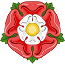

## Cathrine of Aragon

### About this project
This project about the Queen Cathrine of Aragon was made to give the user a teaser about the special time and personalities that lived at that time in history. The hope is that the user gets inpired to explore and learn more about history, to open up an understanding of why things are as they are in the world as the nowdays is a result of our past.

There is also another reason why it is about Cathrine of Aragon as well, and that is that it was a remarkable woman, and women are usually not that target in modern history, their role in history tends to become a plain shadow of their husbands deeds and importance. This project is an opening-project to more projects that continues the adventure of discovering who else where behind the scenes in our history.

##  Wireframes
I used Balsamiq to create wireframes to design and organize the structure of the site.
I did not keep all the information or images since I realized later that it would be too heavy and less interesting for the user. I changed the background-image of the contact-page since the one I choose melts better into the content and I also changed the Logo since this project would only be about Cathrine of Aragon.

### Features
#### Page One

#### Logo
The Logo at the right side of the page is the name of this project: Cathrine of Aragon and it is information to the user of what to expect of the website and sits on the same left upper coner of all the three pages.

#### Navigation Bar
The Navigation Bar is made so the user can go back and forward between the homepage, the gallery with three different contemporary paintings of Cathrine of Aragon and the Sign-Up side where the user can write the information needed to sign-up for more information. The navigation bar is made in a row at the upper right side of the site and sits in the same right upper corner of all of the three pages.

#### The Hero-image
The Hero-image of Cathrine of Aragon comes after the logo and the navigation-bar and has an animation-effect that move the image foward 10% during five seconds. The image is almost over the whole widht of an upper section of the page.

( )

The image shows Cathrine as a young woman looking a bit down and at her right side the user can see her signature.
All of this above is inside the section of header.

#### Headtitel  
The headtitel is: About Cathrine of Aragon
This titel is written with a larger font-size and it is at the center at the page

#### Tudor Rose
Here the user can see the symbolic Rose of the House of Tudor. The Rose is at the center of the page.

#### Titel for the next section, Timeline
Here comes the titel for the Timeline and sits at the left of the page as the rest of this section.

#### Section for Timeline
Here comes  a reduced timeline of Cathrines life with the most important years of her life.

#### First titel and info
About Cathrines first years of life.

####Second titel and info
About Cathrines marriages.

#### Third titel and info
About Cathrines annulment of marriage with Henry  VIII and her death.

#### Fourth titel and info
About Cathrine of Aragons legacy.

#### Footer
Here comes the socialmedia icons where the user can click to come in contact with the people 
behind Cathrine of Aragons webpage. There is an icon for Facebook, another for Twitter and a 
thrird for Instagram. That is the end of page one and sits at the center bottom of the page and 
it is the same footer that ends all the three pages.

#### Second Page
This second page is called Gallery because that is whee there are paintings of Cathrine there and starts with the Logo and Navigation- Bar.
I selected paintings of Cathrine of Aragon that where painted by contemporary artists so that we could see more personal portraits of the woman behind the throne, more fragil than later artists painted her.

#### First Painting
Here comes a painting where you can see Cathrine as a girl.

#### Second Painting
Here we can see the same image of Cathrine as in the frontpage, but this is an image of the real painting, while the one in the front-page is a bit remade to change the background color and where they added the image of Cathrines signature.

#### Third Painting
Here we can see Catrhine of Aragon depicted as the Penitent Magdalena, a biblical figure.

The Footer is the end of the second page.

#### Third Page
This page is called Sign-up and it is made for just that: signing up if the user wishes and the page starts with the Logo and Navigation- Bar.

#### Background-image
Here we can see a castle by the water at sunset and the image is covering the center-part of this page.

#### Sign-up 
At the left side of the page is a form for signing up, where the user can write up their first named,
second name and mail- address before submitting the information for receiving information directly to 
their e-mail.

This page is also closing-up with the Footer.

## Validator Testing

HTML
No errors were returned when passing through the official W3C  for CSS.
S
No errors were found when passing through the official (Jigsaw) validator

No unfixed bugs found.

Did a test in Lighthouse that showed acceptable results. Since I only did one test that was acceptable, I just have those results:

The website had been tested with good results for responsiveness in those different media screens: Nest Hub Max, Samsung Galaxy A1/71, IPad Mini, IPhone Pro12, IPhone SE.

### Deploymenent

The site was deployed to GitHub pages. The steps to deploy are as follows: 
In the GitHub repository, navigate to the Settings tab
From the source section drop-down menu, select the Master Branch
Once the master branch has been selected, the page will be automatically refreshed with a detailed ribbon display to indicate the successful deployment.
The live link can be found here - [(https://mariahdezg.github.io/Cathrine-of-Aragon/)]

### Credits

I have borrowed many codes from the Code Institutes page of: <Love Running>, specially the codes about the Animation of the front-image and the codes to adapt the page to different dimensions of the media-screens.

I also received much help from found codes in w3school where I found solutions to fixe the placement of the navigation-bar and the footer and also the images in the Gallery-page.

I borrowed a z-media code to help me with the navigation-bar and many more problems from the tutors and fellow students from the Slack-community.

And here are som links to where I found help:

For how to make a Flexbox: 
 [(https://developer.mozilla.org/en-US/docs/Web/CSS/CSS_Positioning/Understanding_z_index/Stacking_context_example_1)] 

For how to make a grid
 [(https://www.w3schools.com/css/tryit.asp?filename=trycss_grid)] 

### Content

The information for the Home page was taken from Wikipedia Article [(https://en.wikipedia.org/wiki/Catherine_of_Aragon)]
Instructions on how to implement form validation on the Sign Up page was taken from Specific YouTube Tutorial
The icons in the footer were taken from Font Awesome.

#### Media
The image used in the home page is from [ Cathrine of Aragon as young] (https://www.thehistorypress.co.uk/media/2503/satherin-of-aragon-hero.jpg?anchor=center&mode=crop&quality=98&rnd=131433073940000000&width=1500&height=520 )

The image of the Tudor-Rose is from: [(https://upload.wikimedia.org/wikipedia/commons/thumb/3/3f/Tudor_Rose.svg/1200px-Tudor_Rose.svg.png )]

The image used on the sign up page are from this Open Source site:[( http://4everstatic.com/bilderse/850xX/byggnader/historiskt/slottet-chillon,-slott-vid-vatten,-solnedgang,-sjo-227295.jpg)] 

The images used for the gallery page are from those sites:
[(https://en.wikipedia.org/wiki/Catherine_of_Aragon#/media/File:Juan_de_Flandes_002.jpg )]

[(https://images.fineartamerica.com/images-medium-large/queen-katherine-of-aragon-1485-1536-everett.jpg
 )]

[(https://images.fineartamerica.com/images/artworkimages/mediumlarge/2/catherine-of-aragon-as-the-magdalene-michel-sittow.jpg )]